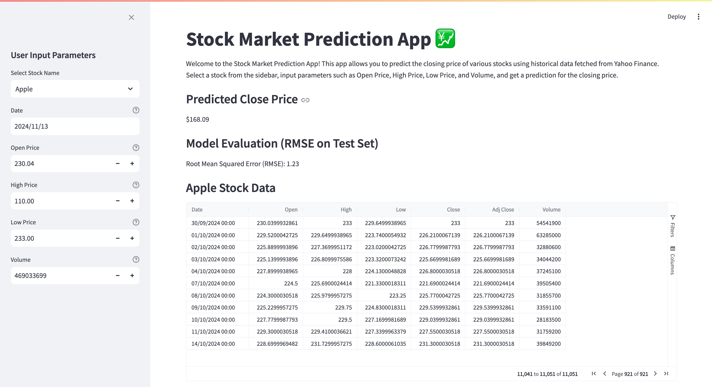

# Machine Learning with XGBoost and Streamlit

Machine Learning (ML) and Artificial Intelligence (AI) are transforming industries, enabling smarter decision-making and automation of complex tasks. In recent years, the rise of ML models—such as large language models like [ChatGPT](https://chat.openai.com/)—has thrust these technologies into the spotlight. With a growing number of tools available for creating machine learning models, knowing where to begin can be challenging. However, smart technology professionals are mastering these tools to unlock new possibilities and drive innovation. Two tools that stand out in this landscape are [Streamlit](https://streamlit.io/) and [XGBoost](https://xgboost.ai/) (eXtreme Gradient Boosting). In this post, we’ll explore how to use them to build a stock market prediction app.

## Why Predict Stock Prices?

Stock prices are influenced by countless factors, making them difficult to predict with traditional methods. Machine learning helps to identify hidden patterns in stock market data. By feeding historical data into a model, we can generate predictions for future stock prices. In this tutorial, we’ll use the `XGBoost` algorithm to predict the closing price of a stock and `Streamlit` to build a simple web app where users can input stock data and receive predictions.

Here’s a preview of what our app could look like:



## Step 1: Fetching Stock Market Data

First, we need to obtain stock market data. We’ll use the [Yahoo Finance](https://pypi.org/project/yahoo-finance/) library, which provides details such as open price, close price, high price, low price, and volume of trades.

Here’s a function that downloads stock data for a given stock symbol:

```python
import yfinance as yf

def load_data(stock_symbol):
    data = yf.download(stock_symbol)
    return data
```

This function retrieves historical stock data, which we can use to train our model and make predictions. We’ll focus on predicting the stock's closing price using other features like open, high, low prices, and trading volume.

## Step 2: Preparing the Data

Machine learning models require structured input data. We need to split the data into features (inputs) and the target (output) we aim to predict.

The `XGBRegressor` model from XGBoost is ideal for regression tasks, such as predicting continuous values like stock prices. We'll use the `Close` price as our target variable.

```python
xg_reg = xgb.XGBRegressor(objective='reg:squarederror', n_estimators=100)
xg_reg.fit(scaled_train_data, train_data['Close'])
```

This model learns the relationship between the input features (open, high, low prices, and volume) and the output (close price). Once trained, the model is ready to make predictions.

## Step 3: Making Predictions

After training, we can use the model to predict the closing price for new data. Here’s how we input stock data and get a prediction:

```python
input_data = np.array([[open_price, high_price, low_price, volume]])
input_data_scaled = scaler.transform(input_data)
prediction = xg_reg.predict(input_data_scaled)[0]
```

Before feeding the input data into the model, we scale it, as scaling helps improve model performance.

## Step 4: Building the App with Streamlit

Streamlit makes it easy to turn Python scripts into interactive web applications. Let’s build a simple app where users can input stock information (e.g., open price, high price) and receive a predicted closing price.

### User Input for Prediction

Create a file named `app.py` with the following code to handle user inputs:

```python
import streamlit as st
from datetime import datetime
import numpy as np
import xgboost as xgb
from sklearn.preprocessing import StandardScaler
import yfinance as yf

# Load stock data
def load_data(stock_symbol):
    data = yf.download(stock_symbol)
    return data

# Create input fields for user input
stock_symbol = st.text_input("Stock Symbol", value="GOOGL", max_chars=5)
prediction_date = st.date_input("Prediction Date", value=datetime.today())
open_price = st.number_input("Open Price", value=100.0)
high_price = st.number_input("High Price", value=110.0)
low_price = st.number_input("Low Price", value=90.0)
volume = st.number_input("Volume", value=1000000)
```

### Data Preprocessing and Model Training

Next, let's include the data preprocessing and model training inside the app:

```python
# Load historical data for the selected stock symbol
data = load_data(stock_symbol)

# Prepare the data for training
data['Return'] = data['Close'].pct_change()
data.dropna(inplace=True)

# Define features and target variable
X = data[['Open', 'High', 'Low', 'Volume']]
y = data['Close']

# Scale the features
scaler = StandardScaler()
X_scaled = scaler.fit_transform(X)

# Train the model
xg_reg = xgb.XGBRegressor(objective='reg:squarederror', n_estimators=100)
xg_reg.fit(X_scaled, y)
```

### Model Evaluation

After training the model, we should evaluate its performance using metrics like Root Mean Squared Error (RMSE). This can be displayed in the Streamlit app:

```python 
from sklearn.metrics import mean_squared_error

# Predict on the training data
y_pred = xg_reg.predict(X_scaled)
mse = mean_squared_error(y, y_pred)

# Calculate RMSE
rmse = mse ** 0.5

# Display the Root Mean Squared Error
st.write(f"Root Mean Squared Error of the model: {rmse:.2f}")
```

### Making Predictions

Now we can add functionality to predict the closing price based on user input:

```python
if st.button("Predict"):
    input_data = np.array([[open_price, high_price, low_price, volume]])
    input_data_scaled = scaler.transform(input_data)
    prediction = xg_reg.predict(input_data_scaled)[0]
    st.write(f"Predicted Closing Price: ${prediction:.2f}")
```

This complete interface allows users to input stock data. Upon submission, the app runs the model in the background and returns a prediction.

## Step 5: Setting Up the Project

To run the app locally, you'll need a `requirements.txt` file to specify dependencies. Create this file with the following contents:

```
streamlit
xgboost
yfinance
scikit-learn
numpy
```

Install these dependencies by running:

```bash
pip install -r requirements.txt
```

Once installed, start the Streamlit app with:

```bash
streamlit run app.py
```

This command will open the app in your browser, allowing you to input stock details and receive predictions.

## Step 6: Deploying the App

Several options are available for deploying your Streamlit app:

- **[Streamlit Community Cloud](https://streamlit.io/cloud)**: A free and easy way to deploy your Streamlit app online. You can link a GitHub repository for automatic deployment.
- **[GitHub Codespaces](https://docs.streamlit.io/get-started/installation/community-cloud)**: If you want an online development environment, GitHub Codespaces lets you code, run, and deploy entirely from the cloud.

To deploy with Streamlit Community Cloud:
1. Push your code to a GitHub repository.
2. Go to [Streamlit Community Cloud](https://streamlit.io/cloud), link your repository, and deploy instantly.

## Why Use XGBoost and Streamlit?

XGBoost is highly valued for its speed and performance in predictive analytics, making it a go-to tool for data scientists. Streamlit allows developers to quickly create web-based applications without frontend development concerns. By combining these tools, you can build powerful machine learning applications that are both efficient and user-friendly.

## Conclusion

In this tutorial, we built a simple stock market prediction app using XGBoost for the machine learning model and Streamlit for the user interface. While stock price prediction is complex and influenced by numerous factors, this example shows how machine learning can help with predictive modeling.

Continue exploring by experimenting with different datasets and model parameters to improve your app’s accuracy. Whether predicting stock prices or tackling other data-driven tasks, XGBoost and Streamlit offer a powerful toolkit for building impactful machine learning applications.
